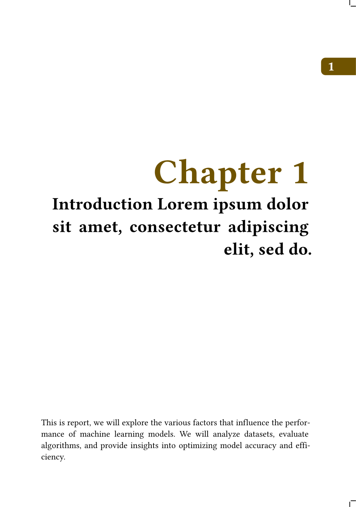
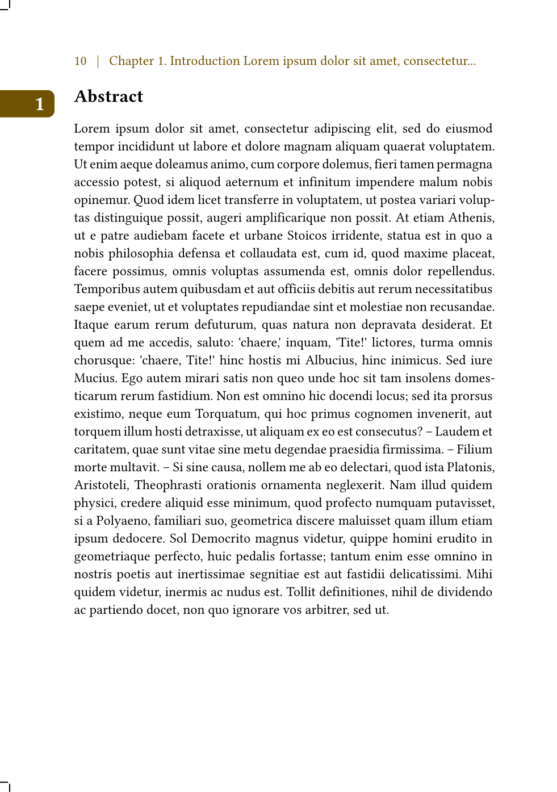
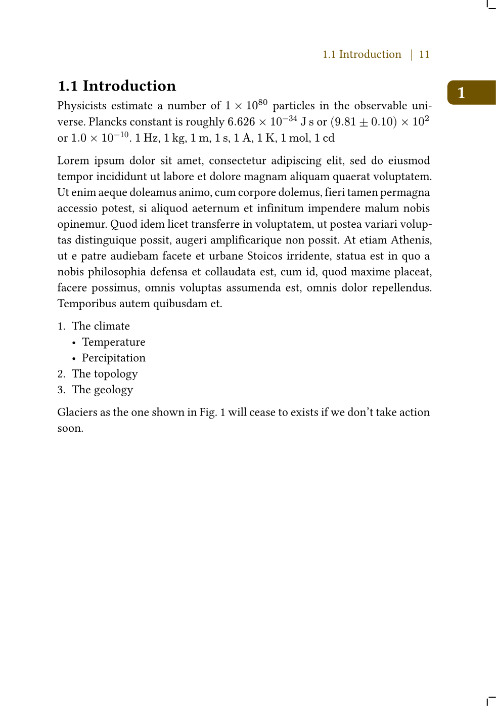
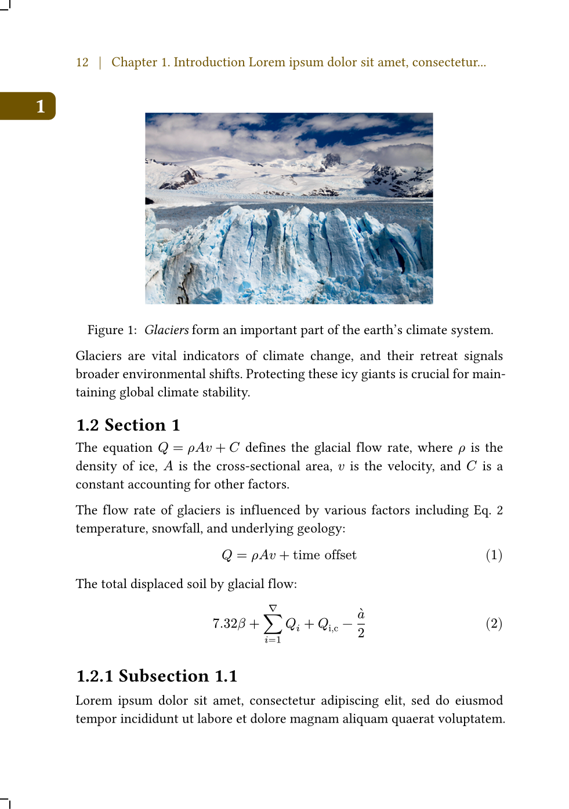
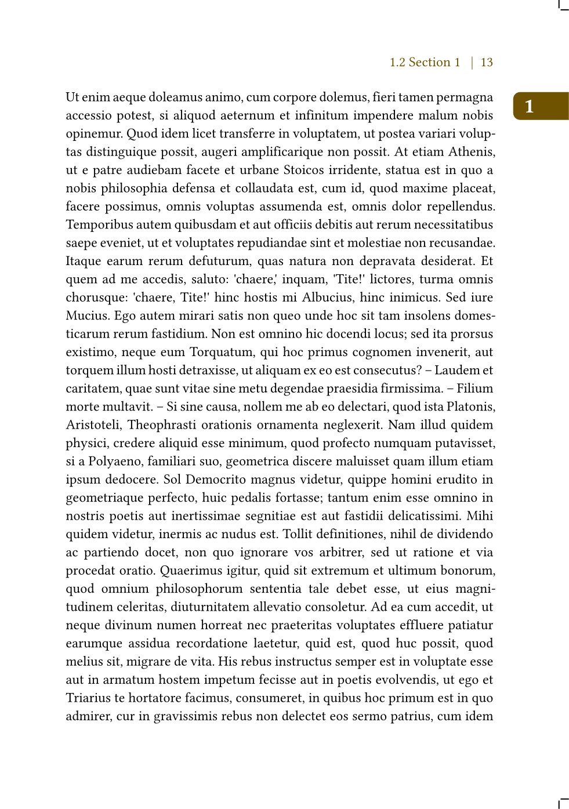

# Minimal TU Delft PhD Thesis Template in Typst

This is a minimal version of the [TU Delft PhD thesis template](https://www.tudelft.nl/en/tu-delft-corporate-design/downloads/). The template was derived from the LaTeX template: https://github.com/Inventitech/phd-thesis-template. It was originally designed for a A5 book (170 mm x 240 mm), featuring double-sided with the chapter number on odd and even pages.

This minimal template only implements:

- The ribbon showing the chapter number on odd and even pages
- Two formats (defined in `style.typ`):
  - `format=print`: for the book publisher. The exported PDF includes extra offsets and cutting marks.
  - `format=digital`: for a digital PDF.
- The heading section of the page automatically shows the current chapter name on the even pages and the current section name on the odd pages.
- The chapters always starts at the odd page.
- The second page after the chapter cover page shows the abstract.

> [!note]
> This is the minimal template. Some features still need to be implemented, such as reference and bibtex. 

## Motivation

The motivation for this project was to identify a modern, budget-friendly typesetting system capable of handling a complex document structure (e.g., a thesis with detailed design and artwork).

Typst vs. LaTeX: Since both systems were new to me, an evaluation was conducted. A complex LaTeX template was challenged to be converted into a working Typst equivalent within one week. The successful completion of this test confirmed that Typst possesses the requisite power and flexibility for sophisticated document design.

## Examples (format=print)

| Odd page                        | Even page                       |
| ------------------------------- | ------------------------------- |
|   |  |
|  |  |

## Installation

- [VScode](https://code.visualstudio.com/) and the extension: [Tinymist Typst](https://marketplace.visualstudio.com/items?itemName=myriad-dreamin.tinymist)
- [Typst >0.13](https://github.com/typst/typst)
- Download or clone this repository
- Open Vscode > Open Folder... > Select the downloaded folder > Open `main.typ`
- Click "Typst preview: Preview opened file (Ctrl K, V)" at the top-right

## Template

- `main.typ` Main file that includes all chapters and pages
- `./preface/*` a preface
- `./postface/*` a postface
- `./chapters/*` chapters

## Styles

- `style.typ` All defined colors, font size, paragraph setting, and page size.
- `heading_utils.typ` The utility functions to extract the texts of the current section and sub-section.
- `graphic.typ` The graphic functions to draw the ribbons showing the current chapter's number.

## Good resource for learning Typst

- https://typst.app/docs/
- https://sitandr.github.io/typst-examples-book/book/packages/layout.html
